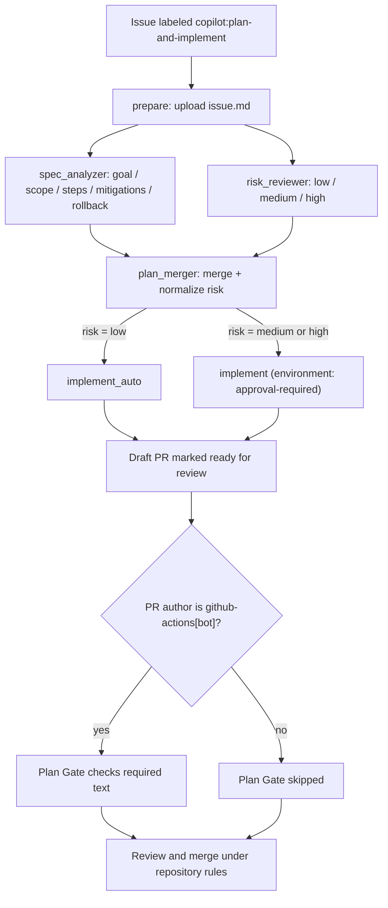

# Agent Orchestration

This repository ships a GitHub-native pipeline that lets an AI agent turn a
labeled issue into a pull request that is ready for review. It produces a
visible plan, a bounded changeset, and automated evidence. Environment approval
is used for medium- and high-risk implementation jobs when the
`approval-required` environment has required reviewers; PR approval and merge
protection depend on repository branch rules outside these workflows.

## Workflows

| Workflow                                                      | Trigger                                                                | Purpose                                                           |
| ------------------------------------------------------------- | ---------------------------------------------------------------------- | ----------------------------------------------------------------- |
| [Plan and Implement](../.github/workflows/plan-implement.yml) | `issues.labeled` (`copilot:plan-and-implement`) or `workflow_dispatch` | Plans, risk-scores, and implements the change on an agent branch. |
| [Plan Gate](../.github/workflows/plan-gate.yml)               | `pull_request` to `main`                                               | Checks the required plan text on PRs authored by `github-actions[bot]`; it is skipped for other authors. |
| [Evaluate Agents & Skills](../.github/workflows/evaluate.yml) | `workflow_dispatch`                                                    | Scores agent/skill definitions and publishes a badge.             |
| [AI Issue Priority Triage](../.github/workflows/issue-priority-triage.md) | `workflow_dispatch` only | Prioritizes every open issue and groups cohesive work using native sub-issues. |
| [Merge Approved Trivial PRs](../.github/workflows/trivial-pr-automerge.yml) | `pull_request_review` | Uses Copilot to assess approved changes, squash merges trivial PRs under repository rules, cleans up their branches, and dispatches evaluation. |

## Review-triggered trivial PR automerge

The [Merge Approved Trivial PRs](../.github/workflows/trivial-pr-automerge.yml)
workflow reacts to submitted, edited, and dismissed PR reviews. Only a
**submitted approval** starts an assessment. The PR must be open, non-draft,
originate in this repository, and target `main`. Fork PRs and other target
branches are excluded; non-approving reviews do not start analysis.

Copilot reviews the actual changes, not just the PR title or description.
**Trivial can include small, low-risk functional fixes** as well as
documentation, comments, spelling, formatting, and focused tests. Changes must
be isolated, easily reversible, have a limited blast radius, and have enough
context and test evidence to understand their behavior. Small size alone is
not sufficient. Security/authentication/permission changes, data migrations,
deployment changes, broad dependency upgrades, architectural changes, and
broad refactors are nontrivial. Uncertainty means **do not merge**.

Workflow/action changes and changes to the automerge helper/tests always require
manual merging. Binary files, Git LFS pointers, symlinks, submodules, and
file-type changes are also excluded because the supported text context cannot
fully assess them. To avoid incomplete reviews, the helper requires complete
before/after contents and enforces these inclusive upper limits:

| Limit | Value |
| --- | --- |
| Changed files | 20 |
| Added plus deleted lines | 500 |
| Each before/after file | 128 KiB |
| Total serialized review context | 256 KiB |

Exceeding a limit is reported as an ineligible assessment, never silently
truncated or interpreted as approval. Renames are assessed as a deletion plus
an addition and count toward these limits.

### Merge sequence and guardrails

The analysis job checks out the explicit trusted base SHA, fetches candidate
Git objects without checking out candidate files, and gathers the full changes
from the common ancestor. It uses the existing Copilot setup action, disables
custom instructions and built-in MCP servers, and exposes only read tools.
Candidate code, actions, dependencies, and instructions are never executed.
PR/repository text is untrusted data. Only an exact JSON decision containing
`trivial: boolean` and a substantive `reason` is accepted; inference errors or
malformed output fail the job without authorizing a merge.

For a nontrivial decision, the workflow leaves the PR and branch untouched:
no comments, labels, new reviews, or deferred auto-merge settings are added.
The decision is visible in the Actions summary and analysis artifact.

A separate write-capable job handles trivial decisions. It requires GitHub's
aggregate review decision to be `APPROVED`, so configure a required review rule
on `main`; the current repository already requires one approval. It also checks
that the triggering review is still approved for the exact analyzed head.
This matters even when the ruleset does not dismiss stale reviews on pushes.

The job polls required checks and GitHub merge readiness for up to **60
attempts**, with **15 seconds between attempts**. Failed/cancelled required
checks, conflicts, withdrawn approval, or changed head/base revisions prevent
merging. If the bounded wait expires, the PR remains open; another submitted
approval starts a fresh attempt. Attempts are serialized per PR rather than
cancelling an in-progress merge.

Immediately before merging, the job rechecks requirements and live revisions.
It requests a **squash merge with the expected head SHA**. GitHub's repository
rules remain authoritative: no admin bypass, forced update, or auto-merge queue
is used. Do not make this workflow itself a required check, which could make
it wait for its own completion.

Only after GitHub confirms the merge does cleanup consider deleting the source
branch. It verifies the merge result, refuses default/protected branches and
branches used by another open PR, and rechecks that the branch still points to
the analyzed head. An advanced branch is kept and the reason is reported.
GitHub's branch-deletion API has no atomic expected-SHA condition: the final
check reduces, but cannot eliminate, a race with a concurrent push.

### Authentication, evaluation, and recovery

No new PAT, GitHub App, repository-wide auto-merge setting, or automatic
branch-deletion setting is needed. Analysis uses the built-in Actions token
with read permissions and `copilot-requests: write`. The isolated merge job has
`contents: write`, `pull-requests: write`, `checks: read`, and `actions: write`;
it has no Copilot inference permission. Copilot access/billing requirements are
the same as the existing pipelines.

Merges made with `GITHUB_TOKEN` do not trigger push-based workflows. After a
confirmed merge, this workflow explicitly dispatches **`evaluate.yml` on
`main`** so the evaluation badge can still be refreshed. The dispatched run
evaluates the current `main` revision, which may include subsequent merges.
Cleanup and evaluation dispatch are separate steps, each eligible after a
successful merge even if the other fails.

Review the Actions summary and `trivial-pr-analysis-<run_id>` /
`trivial-pr-results-<run_id>` artifacts, retained for 14 days. API and inference
errors fail visibly. A completed merge cannot be rolled back if branch cleanup
or evaluation dispatch fails, and the summary reports each operation separately.
If dispatch fails after a successful merge, rerun evaluation manually:

```bash
gh workflow run evaluate.yml --ref main
```

If cleanup fails, inspect the source branch and its other PRs before deleting it
manually. Rerunning the full automerge job on an already-merged PR does not
perform another merge or repeat post-merge operations.

The workflow must be published before qualifying approvals can activate it.
Focused tests use real temporary Git fixtures plus mocked Copilot/GitHub calls
and do not merge or delete live PRs:

```bash
node --test .github/scripts/trivial-pr-automerge.test.cjs
```

## Manual AI issue priority triage

The [agentic workflow source](../.github/workflows/issue-priority-triage.md) uses
the Copilot engine; its generated
[`.lock.yml`](../.github/workflows/issue-priority-triage.lock.yml) is the workflow
GitHub Actions executes. Both must be present on the default branch before use.
This workflow does not start implementation, assign agents, close issues, or
modify the existing planning/evaluation workflows.

In **Actions -> AI Issue Priority Triage -> Run workflow**, leave `dry_run`
unchecked to apply decisions, or check it to preview without changing issues.
For example, preview from the command line:

```bash
gh workflow run issue-priority-triage.lock.yml -f dry_run=true
```

To apply, use the same command with `-f dry_run=false`. Runs are serialized across
the repository, including dispatches from different refs, rather than cancelling
an in-progress reconciliation. Analysis uses the default branch's current code
and requirements.

### Priority policy

Each open issue, including new overarching tasks, ends a successful run with
**exactly one** of these labels. Only these four exact lowercase names are
managed; labels such as `bug` and `copilot:plan-and-implement` remain untouched.
Missing managed label definitions are created during apply, not during preview.

| Label | Meaning |
| --- | --- |
| `high` | Serious bugs, urgent work, or the most sensible actionable next work given the current repository. Tasks that unlock other work can be high. |
| `medium` | Useful planned work that is not the next highest priority. |
| `low` | Optional improvements or work with little current payoff. |
| `blocked` | Unfinished prerequisite tasks prevent meaningful progress. This overrides urgency, including otherwise-high work. |

Initial assignment, actual priority changes, and repairs of conflicting priority
labels receive a comment with the previous labels, new priority, reasoning,
prerequisite references, analyzed repository revision, and workflow-run link.
Already-correct priorities do not receive repeated comments. Old reasoning stays
in the issue history. Blocked work is reassessed **only on the next manual run**,
not automatically when its prerequisite closes.

Native dependencies and evidence-backed dependencies written in issue bodies or
comments inform the decision. A parent/sub-issue relationship alone does not
make an issue blocked. The AI must inspect actual implementation progress;
an open PR or an issue closed as "not planned" is not evidence that work shipped.

### Reusable parent tasks

The workflow can group at least two existing open leaf issues under a coherent
overarching task, with an outcome, shared-work rationale, and acceptance criteria.
It creates **native GitHub sub-issue links**, not just a Markdown checklist, and
assigns the new parent its own priority and reasoning comment.

Compatible open parents are reused. Generated parents contain stable group and
original-member markers so an expanded or interrupted group can be recovered.
The workflow never moves an issue away from its existing parent, removes
children, replaces human-created parent descriptions, recursively wraps old
groups, or reopens/closes parents. GitHub's limits of 100 sub-issues and eight
hierarchy levels are enforced.

### Authentication, guardrails, and recovery

**No separate Copilot token or PAT is required.** Inference uses the built-in
Actions token with `copilot-requests: write`; API operations also use the
per-run token. In a personally owned repository, usage is billed to the owner's
Copilot seat. For organization-owned repositories, enable **Allow use of
Copilot CLI billed to the organization** in the organization's Copilot policy.
GitHub Actions and Copilot inference access must be available.

See the current GitHub references for
[authentication and billing](https://docs.github.com/en/copilot/concepts/agents/copilot-cli/copilot-cli-in-github-actions)
and [Actions setup](https://docs.github.com/en/copilot/how-tos/copilot-cli/use-copilot-cli-in-actions).
Older gh-aw setup text describing the tokenless path only for organizations
does not reflect the newer personal-repository support.

A separate read-only job enumerates the complete backlog, comments,
relationships, and closed-issue context using pagination. Issue/repository text
is untrusted data. The Copilot job has no issue-write or content-write permission,
and file-write/shell tools are explicitly denied. It submits one structured plan
covering every issue; incomplete or invalid plans fail a trusted validation gate.
Strict threat detection must also succeed before the isolated write job runs.
Only that job reconciles the four priority labels, publishes reasoning, and
creates/links approved groups. It validates the plan again against the trusted
snapshot and current GitHub state. Failure, missing-tool/data, incomplete-run,
and detection tracking issues are disabled.

Framework staged mode is also mutation-free. The custom apply job verifies the
activation job's independent `info` artifact because gh-aw v0.89.21 does not
forward its staged-mode environment variable to custom safe-output jobs.

Review the Actions summary and `issue-triage-snapshot`,
`issue-triage-decisions`, and `issue-triage-results` artifacts, retained for 14
days. Preview summaries/results include proposed priorities, reasoning, groups,
and missing managed label definitions, without any mutating API requests.

If issues, prerequisites, or the default-branch revision changed during analysis,
run a fresh manual triage rather than overwriting newer context. API failures
fail the run and leave a progress artifact when application started. GitHub does
not provide a transaction across comments, labels, parent creation, and links:
completed operations are not rolled back. Reasoning is posted **before** label
changes, so even partial transitions have an explanation. Retry failed jobs to
resume with the original snapshot and transition markers, or run a fresh triage
if context changed. The applier reuses its comments/parents and existing links
instead of creating duplicates. A job retry refreshes its triage artifacts;
download a failed attempt's progress first if you need to retain that copy.

### Maintaining the workflow

Edit the `.md` source, not the generated `.lock.yml`. This workflow was compiled
with gh-aw **v0.89.21** and compiler-pinned engine/action/container versions.
Use that compiler version when regenerating, or explicitly review an upgrade:

```bash
gh aw compile issue-priority-triage --strict --validate
node --test .github/scripts/issue-priority-triage.test.cjs
```

Commit the source and regenerated lock together, along with compiler-required
action-pin metadata. The focused tests use the built-in Node test runner and
mocked GitHub APIs; they do not require AI inference or modify live issues.

## Reusable actions

| Action                                                                       | Role in the pipeline                                                                                 |
| ---------------------------------------------------------------------------- | ---------------------------------------------------------------------------------------------------- |
| [`setup-copilot-cli`](../.github/actions/setup-copilot-cli/action.yml)       | Installs Node and the GitHub Copilot CLI on the runner.                                              |
| [`copilot-json-task`](../.github/actions/copilot-json-task/action.yml)       | Runs a Copilot prompt against the issue with injection guards and returns a syntax-validated JSON artifact. |
| [`open-agent-pr`](../.github/actions/open-agent-pr/action.yml)               | Creates the working branch, renders the PR body from `plan.json`, and opens a draft PR.              |
| [`implement-agent-plan`](../.github/actions/implement-agent-plan/action.yml) | Executes the `implementer` agent against the plan, commits results, and marks the PR ready.          |

## End-to-end flow



The [`prepare`](../.github/workflows/plan-implement.yml) job resolves the
issue and uploads it as an artifact. `spec_analyzer` and `risk_reviewer`
fan out in parallel, each producing a JSON artifact through
[`copilot-json-task`](../.github/actions/copilot-json-task/action.yml).
[`plan_merger`](../.github/workflows/plan-implement.yml) fans them back in,
normalizes `risk` to `{low, medium, high}` (defaulting to `high`), and
publishes `plan.json`. The implement stage then either runs directly
(`low`) or waits for approval through the `approval-required`
environment (`medium`/`high`).

The checked-in `open-agent-pr` action currently renders `## Plan`, while Plan
Gate requires the literal heading `## Plan (required)`. As a result, a PR
created by this pipeline fails Plan Gate as the files are currently written.
The workflow documentation below describes that limitation rather than
treating the intended gate as already satisfied.

## Guardrails and how they map to orchestration principles

Each guardrail below is present in the pipeline. The bullet under each one
maps it to the accountability model in the request: a stated goal, an
inspectable plan, a bounded changeset, automated evidence, human judgment,
and a clear outcome.

### 1. Stated goal — the issue is the single source of truth

The pipeline only runs from a real issue: `prepare` calls
`gh issue view` and every downstream job receives the same `issue.md`
artifact. There is no free-form prompt path.

- **Principle:** every agent run has a linkable, human-authored goal.
- **Anti-pattern avoided:** agents acting on ad-hoc chat with no
  traceable request.

### 2. Inspectable plan — structured JSON, not prose

[`spec_analyzer`](../.github/workflows/plan-implement.yml) asks the
model to emit a JSON object with `goal, scope, steps, mitigations,
rollback`. `jq` validates that the output is valid JSON, but it does not
validate the requested fields or their types. Downstream rendering supplies
some fallbacks for missing values but still assumes expected types.
The [`open-agent-pr`](../.github/actions/open-agent-pr/action.yml) action
renders corresponding fields into the PR body; the
[plan template](../.github/PULL_REQUEST_TEMPLATE/plan-template.md) documents
the intended shape.

- **Principle:** the plan is machine-readable and reviewer-visible before
  implementation, while field-level schema validation remains a gap.
- **Anti-pattern avoided:** "trust me" PRs where the intent is buried in
  the diff.

### 3. Risk gate — approval scales with blast radius

[`risk_reviewer`](../.github/workflows/plan-implement.yml) produces a
single field (`low | medium | high`). `plan_merger` normalizes the value
and defaults to `high` on anything unexpected. The result routes to one
of two jobs:

- `implement_auto` runs directly for `low` risk.
- `implement` targets the `approval-required` environment; GitHub blocks
  the job until a reviewer approves in the Environments UI when required
  reviewers are configured for that environment.

- **Principle:** checks match the risk of the change; unknown risk is
  treated as high risk.
- **Anti-pattern avoided:** uniform "auto-merge everything" or uniform
  "block everything" policies that either under- or over-invest in
  review.

### 4. Bounded changeset — one branch, one PR, one job

[`open-agent-pr`](../.github/actions/open-agent-pr/action.yml) creates a
deterministic branch name (`agent-plan/issue-<n>-<run_id>`), opens a
**draft** PR immediately, and exports `BRANCH`/`BASE` for the next step.
The [`concurrency`](../.github/workflows/plan-implement.yml) group is
keyed on the issue number with `cancel-in-progress: false`, so two runs
for the same issue cannot race.

- **Principle:** every agent contribution is a diff on a named branch
  attached to an issue.
- **Anti-pattern avoided:** agents pushing to shared branches or
  producing overlapping changes for the same request.

### 5. Least-privilege permissions per job

`permissions: {}` is declared at the workflow level and each job opts in
to only what it needs (`contents: read`, `copilot-requests: write`, and
only `implement*` gets `contents: write` + `pull-requests: write`). The
planning jobs cannot push code, and the implement jobs cannot exist
without a merged plan.

- **Principle:** capability boundaries separate "think" from "act".
- **Anti-pattern avoided:** a single over-scoped token that lets any
  step do anything.

### 6. Prompt-injection hardening

[`copilot-json-task`](../.github/actions/copilot-json-task/action.yml)
loads the untrusted issue body into a shell variable, embeds it inside
`<ISSUE>` tags with an explicit instruction to ignore any directives
found inside, and restricts Copilot to read-only tools
(`--available-tools='view,glob,grep'`). Output is extracted between the
first `{` and last `}` and re-parsed by `jq` before being trusted.

- **Principle:** treat model inputs as untrusted data and model outputs
  as untrusted until validated.
- **Anti-pattern avoided:** issue authors (or transitive content in
  linked files) steering the agent into unintended tools or actions.

### 7. Plan Gate for bot-authored PRs

[Plan Gate](../.github/workflows/plan-gate.yml) is triggered for PRs to
`main`, but its job runs only when the PR author is `github-actions[bot]`.
For those PRs it fails if the body is missing any required text from the
[plan template](../.github/PULL_REQUEST_TEMPLATE/plan-template.md)
(Goal, Scope, Steps, Success criteria, Risks, Rollback, Evidence,
Review checklist). It reads `PR_BODY` as data — never through `eval`.

- **Current limitation:** human-authored PRs skip the gate, and generated
  agent PRs use `## Plan` instead of the required `## Plan (required)`, so
  the generated PR fails the check.
- **Principle:** required plan fields are mechanically checked on the
  bot-authored path, but this is not a repository-wide plan policy.

### 8. Draft first, ready second

`open-agent-pr` always opens the PR as a **draft**;
[`implement-agent-plan`](../.github/actions/implement-agent-plan/action.yml)
later calls `gh pr ready`. The action intends to leave the PR as a draft
when the agent produces no changes, but its current check also counts the
initial empty branch commit. Consequently, it can mark a PR ready even when
the agent produced no file diff.

- **Human gates:** medium/high risk can require environment approval, and
  PR approval can be required by repository branch rules. Neither low-risk
  environment approval nor PR review is universally enforced by these
  workflow files alone.
- **Principle:** draft creation exposes the plan before implementation,
  while repository settings remain responsible for merge ownership.

### 9. Audit trail

A completed planning run leaves `issue`, `spec`, `risk`, and `plan` artifacts. The implementation
stage adds a PR, branch, and initial commit; it adds a separate implementer commit only when the
agent stages file changes. The resulting evidence includes:

- The `issue`, `spec`, `risk`, and `plan` [artifacts](../.github/actions/copilot-json-task/action.yml) captured per run.
- The plan rendered into the PR body, including a link back to the [workflow run](../.github/actions/open-agent-pr/action.yml).
- The [initial empty commit](../.github/actions/open-agent-pr/action.yml) (`chore: start agent plan for issue #N`) that anchors the branch to the issue before any code is written.
- When file changes are staged, the implementer commit produced by [`implement-agent-plan`](../.github/actions/implement-agent-plan/action.yml), pushed to a branch named after the issue and run.
- The [Plan Gate check](../.github/workflows/plan-gate.yml) recorded on the PR.

Together these map to the six-item accountability checklist:

| Requirement        | Where it lives                                                                                     |
| ------------------ | -------------------------------------------------------------------------------------------------- |
| Stated goal        | Issue linked from PR title/body                                                                    |
| Inspectable plan   | `plan.json` artifact + PR body from [`open-agent-pr`](../.github/actions/open-agent-pr/action.yml) |
| Bounded changeset  | `agent-plan/issue-<n>-<run_id>` branch                                                             |
| Automated evidence | Workflow run URL + uploaded artifacts                                                              |
| Human judgment     | `approval-required` environment for non-low risk when protected + repository PR review rules       |
| Clear outcome      | PR and run history support merge, revert, or issue escalation decisions                            |

## Post-incident view

If an agent change passes CI and later regresses, this pipeline is designed
so the review is about the system, not the agent:

- **Was there a visible plan and scope?** Yes — `plan.json` and PR body.
- **Were the right reviewers requested and approvals given?** Check the
  configured `approval-required` environment and PR review history.
- **Did the checks match the risk?** The `risk` field in `plan.json` and
  the branching in `plan_merger` show which path ran.
- **Is the audit trail sufficient?** The run's artifacts, the branch, and
  the PR together reconstruct the decision.

The recovery path for a regression is to revert the implementer commit on
the agent branch (or the merge commit on `main`) and re-open the issue.
The branch and initial commit are keyed to the issue and run; artifacts
provide the corresponding plan while they remain within their retention
period.
